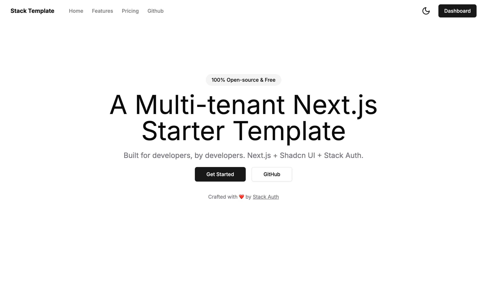
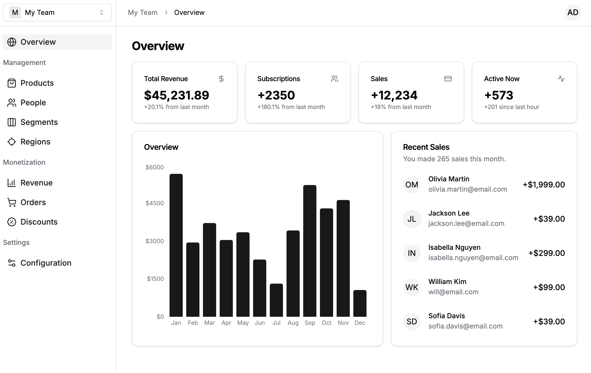
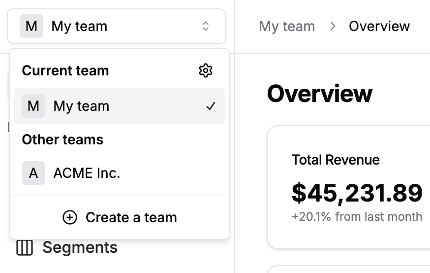
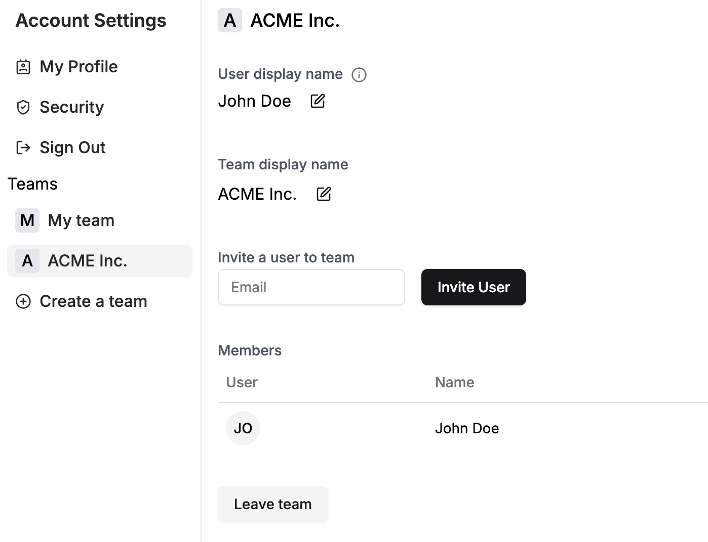

# Next.js Multi-tenant Starter Template

A minimalistic multi-tenant Next.js starter template with minimal setup and a modular design. Bring your own backend and database.

[Demo](https://stack-template.vercel.app/)

## Landing Page

<div align="center">

</div>

## Dashboard

<div align="center">

</div>

## Multi-tenancy (Teams)

<div align="center">

</div>

## Account Settings

<div align="center">

</div>

## Getting Started

1. Clone the repository

    ```bash
    git clone https://github.com/Linaressss073/IPS.git
    ```

2. Install dependencies

    ```bash
    npm install
    ```

3. Create an application in [Clerk](https://dashboard.clerk.com), enable **Organizations** (each IPS is one) and
    put its keys in `.env.local` (see `.env.local.example`).

4. Start the development server and go to [http://localhost:3000](http://localhost:3000)

    ```bash
    pnpm dev
    ```

    `pnpm dev` runs `next dev --turbopack`. Authentication and organizations (one per IPS) come from Clerk: copy
    `.env.local.example` to `.env.local` and fill in the keys of the same Clerk application the API (`../api`) uses.

## Features & Tech Stack

- Next.js 15 app router (Turbopack)
- TypeScript
- Tailwind & Shadcn UI
- Clerk (auth + organizations)
- Multi-tenancy (teams/orgs)
- Dark mode

## Inspired by

- [Shadcn UI](https://github.com/shadcn-ui/ui)
- [Shadcn Taxonomy](https://github.com/shadcn-ui/taxonomy)
